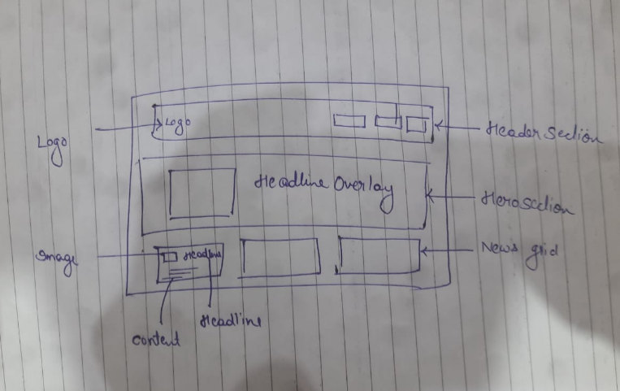

## Part B – Explanation + Documentation

### Design Document





**Layout Decisions:**
*   **Header:** Fixed at the top for easy navigation. Contains the logo and primary category links (Nation, World, Cricket, etc.) to mimic the actual news site structure.
*   **Hero Section:** A large, prominent section at the top for the "Top Story". This draws the user's attention immediately to the most important news. We used a large image with an overlay gradient to make the text readable.
*   **News Grid:** Below the hero, we used a responsive grid layout (1 column on mobile, 3 columns on desktop). This allows for efficient scanning of multiple headlines.
*   **Footer:** Standard footer with quick links and copyright info to anchor the page.

**Data-Fetching Strategy:**
*   **Method:** For a production news app, we would use **Incremental Static Regeneration (ISR)** or **Server-Side Rendering (SSR)**.
*   **Why:** News changes frequently.
    *   *ISR* allows us to serve static pages (fast) but update them in the background after a set interval (e.g., every 60 seconds). This is a great balance between performance and freshness.
    *   *SSR* would ensure the absolute latest news on every request but might be slower under heavy load.
*   **Current Implementation:** For this prototype, we used a mock data file (`lib/data.ts`) to simulate the data structure, which mimics the response we would get from a CMS or News API.

### Code Explanation

**Components Created:**
1.  **`Header`**: Responsive navigation bar with a mobile hamburger menu and dark mode support.
2.  **`HeroSection`**: Displays the featured article with a large background image and overlay text.
3.  **`NewsCard`**: Reusable component for displaying individual news items in the grid. Handles image display, category tags, and hover effects.
4.  **`Footer`**: Static component for site-wide links and information.

**Data Model:**
We defined a TypeScript interface `Article` to ensure type safety:
```typescript
export interface Article {
    id: string;
    title: string;
    summary: string;
    content?: string; // Optional for list view
    image: string;
    category: string;
    author: string;
    publishedAt: string;
}
```

**Challenges & Solutions:**
*   **Challenge:** Text visibility on images and in Dark Mode.
    *   *Solution:* We added a gradient overlay on the Hero image (`bg-gradient-to-t`) to ensure white text is readable. For Dark Mode, we encountered an issue where hardcoded white backgrounds made text invisible. We fixed this by using Tailwind's `dark:` modifiers (e.g., `dark:bg-neutral-900`, `dark:text-gray-200`) to adapt colors dynamically.

**Improvements (Time Permitting):**
*   **Real API Integration:** Connect to a real News API (like NewsAPI.org) instead of mock data.
*   **Search Functionality:** Add a search bar to filter news.
*   **Category Pages:** Create dynamic routes for `/category/[slug]` to filter news by topic.

---

## Part C – Testing / Edge Cases

**Test Scenarios:**

1.  **Missing Image:**
    *   *Behavior:* The `Image` component would fail.
    *   *Fix:* We should add a fallback image URL or a conditional check to render a placeholder if `article.image` is undefined.

2.  **No Articles:**
    *   *Behavior:* The grid would be empty.
    *   *Fix:* Implement a conditional check: `if (articles.length === 0) return <p>No news available</p>;`.

3.  **Long Titles:**
    *   *Behavior:* Could break the layout.
    *   *Fix:* We used the CSS class `line-clamp-2` (Tailwind) on titles. This forces the text to truncate after 2 lines with an ellipsis (...), preserving the grid alignment.

**Error Handling:**
*   **Loading State:** While data is fetching (in a real API scenario), we would display a "Skeleton Loader" (gray boxes mimicking content shapes) to improve perceived performance.
*   **Fetch Failure:** Wrap the data fetching in a `try-catch` block. If it fails, render an error component: "Unable to load news. Please try again later."

---

## Part D – AI Use + Reflection

**AI Contribution**:

Boilerplate & Structure:
AI helped me in debugging issues and also assisted in developing the basic structure of the Next.js project, including components like Header and NewsCard.

Styling:
AI suggested TailwindCSS classes for responsive layouts (such as grid-cols-1 md:grid-cols-3) and provided ideas for hover/transition effects.

Debugging:
AI helped identify the root cause of the “invisible text” issue in Dark Mode (caused by hardcoded bg-white classes) and provided the fix using proper dark: variants.

AI Limitations & Corrections:

Context Awareness:
Initially, the AI was not aware that the system was running in Dark Mode, which caused contrast issues. We had to manually inspect CSS and identify the hardcoded light-mode values.

Mock Data:
AI generated placeholder sample news data. We would still need to manually curate or fetch real API-based data for production-level authenticity.

Custom Modifications:

Design Changes:
We refined the UI by customizing colors, spacing, borders, font sizes, and responsiveness instead of only using the AI’s default suggestions. This made the design look more consistent with a professional news portal.

Modifying the Basic Structure:
We reorganized the project by:

Creating a dedicated components/ folder

Splitting UI and data logic

Moving fake news data to lib/data.ts

Improving file naming and separation of concerns
These structural changes improved readability and long-term maintainability.

Dark Mode Improvements:
We manually applied correct dark: classes to ensure consistent theme behaviour across all components rather than relying solely on automatic detection.
